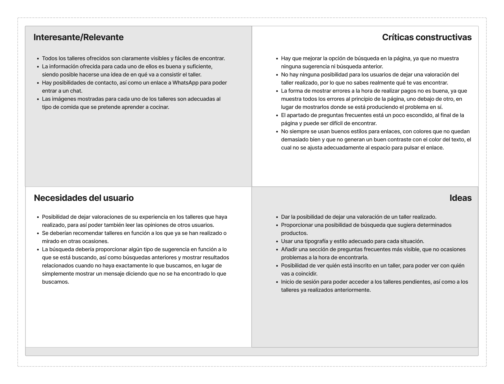

# DIU - Practica 2, entregables

## <a href="https://github.com/carloshoyo/DIU/blob/master/P2/Malla%20receptora.pdf">Ideación. Malla receptora</a>
  Se ha realizado una malla receptora de la página web Granada Cooking (https://granadacooking.com/), a partir de la cual se ha decidido crear una aplicación basada en talleres gastronómicos, que cuente con un mayor número de posibilidades, pudiendo crear su usario y tener un experiencia más personalizada. También contará con un apartado de búsqueda más útil.
  

## PROPUESTA DE VALOR
  _NombreAplicacion_ es una aplicación web para aquellos amantes de la gastronomía a los que no solo les gusta probar la comida, si no que su verdadera pasión es crearla. Se basa en un sistema en el que los clientes se puedan registrar, teniendo así su perfil para poder apuntarse a talleres y dar su opinión acerca de estos. Esto también servirá para poder ver los talleres en los que un usuario está apuntado y los que ha realizado anteriormente, además de poder ver qué otros usuarios hay apuntados a los talleres. Cada cliente tendrá un rango asociado, cuantos más talleres realice, mayor rango podrá alcanzar.

## TASK ANALYSIS
### En un excel, hacer una tabla con todos los requisitos fundamentales de la página, y los usuarios del sistema (en el ejemplo de la profesora eran usuario invitado, usuario preparando un viaje y usuario después de viajar), poniendo el nivel de importancia de 0 (no se usa) a 3 (h(high)) sumando en cada requisito el nivel de uso para cada usuario, de forma que podamos ordenar de más a menos prioridad y poner un corte en aquellos que no vamos a implementar. No sé qué es el User Flow.
* User Task Matrix 
* User/Task flow

## ARQUITECTURA DE INFORMACIÓN
### Diagrama de la página desde la página principal hasta el resto de cosas que vayan a implementarse en ella.
* Sitemap 
* Labelling 

## Prototipo Lo-FI Wireframe 
### Hacer un boceto de la aplicación.

## Conclusiones  
(incluye valoración de esta etapa)
