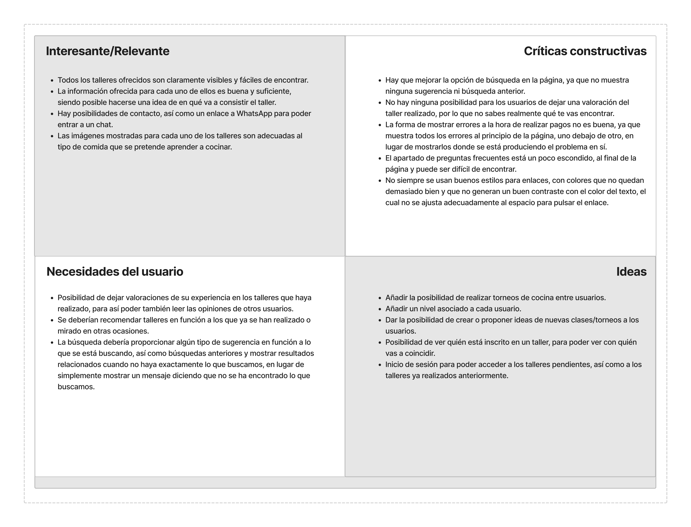
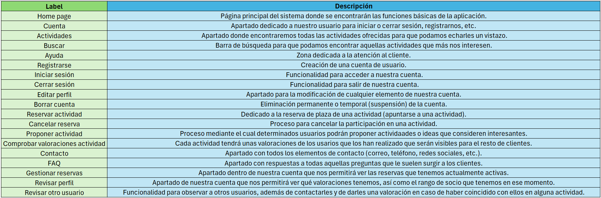

# DIU - Practica 2, entregables

## Ideación. Malla receptora
  Se ha realizado una malla receptora de la página web Granada Cooking (https://granadacooking.com/), a partir de la cual se ha decidido crear una aplicación basada en actividades gastronómicas, que podrán ser clases de cocina o torneos, que cuente con un mayor número de posibilidades, pudiendo crear su usario y tener una experiencia más personalizada. También contará con un apartado de búsqueda más útil.
  

## PROPUESTA DE VALOR
  _ChefZone_ es una aplicación web para aquellos amantes de la gastronomía a los que no solo les gusta probar la comida, si no que su verdadera pasión es crearla. Se basa en un sistema en el que los clientes se puedan registrar, teniendo así su perfil para poder apuntarse a clases torneos de cocina y dar su opinión acerca de estos. Esto también servirá para poder ver las clases y torneos en los que un usuario está apuntado y los que ha realizado anteriormente, además de poder ver qué otros usuarios hay apuntados a estos. Cada cliente tendrá un rango asociado, cuantos más clases complete exitosamente, mayor rango alcanzará. De la misma forma, cuantos más torneos gane, mayor será su rango. Al llegar a un cierto rango, los usuarios podrán crear o proponer sus propias actividades, las cuales podrán hacer de forma individual o colaborando con otros usuarios.

* ## Scope Canvas
  

## TASK ANALYSIS

* ## User Task Matrix
  Se ha hecho una matriz de tareas en la que se tienen en cuenta cuatro grupos de usuarios. En primer lugar, aquellos usuarios que no están registrados, es decir, los invitados, para los cuales no estarán disponibles algunas tareas que requieran tener un perfil de usuario creado. Después tenemos a los usarios registrados, que se dividen en tres, los que se acaban de registrar, los que no tienen niguna plaza reservada en niguna actividad pero ya han realizado alguna anteriormente y los que están apuntados a alguna actividad. Una actividad puede ser tanto una clase como un torneo. En las clases se aprenderán cosas concretas de cocina, mientras que en los torneos se propondrán platos, los cuales deberán ser realizados por los participantes.
  
  
* ## User/Task flow
  
  Se han realizado tres user flow, el <a href="https://github.com/carloshoyo/DIU/blob/master/P2/UserFlow1.pdf">primero</a> representando la acción de apuntarse a una actividad, el <a href="https://github.com/carloshoyo/DIU/blob/master/P2/UserFlow2.pdf">segundo</a> la acción de gestionar reservas, con la opción de modificar o eliminar una reserva y el <a href="https://github.com/carloshoyo/DIU/blob/master/P2/UserFlow3.pdf">tercero</a> la acción de editar el perfil, con las opciones de cambiar foto, nombre, contraseña, correo o biografía del usuario.

## ARQUITECTURA DE INFORMACIÓN

* ## Sitemap
  
* ## Labelling
  
  
      

## Prototipo Lo-FI Wireframe 
Se ha realizado el boceto de la página principal, en la cual encontramos una barra de navegación con un logo (por definir), enlaces a las clases y torneos disponibles, una barra de búsqueda y un apartado para registrarse o iniciar sesión.
Después tenemos el cuerpo, en el cual encontramos por un lado las clases más solicitadas, con una foto, la cual irá cambiando cada ciertos segundos para mostrar diferentes clases y lo mismo en el otro lado para los torneos. Por último, encontramos el pie de página, con un apartado de ayuda y otro para la información acerca de los creadores. La estructura es la siguiente:

Se ha utilizado el plugin Breakpoint para realizar un diseño responsive que funcione tanto en ordeandor como en dispositivos móviles y tablets. Se encuentra <a href="https://www.figma.com/file/NC8mN6Aw2ZVW5NZlr3TDBj/BocetosP2?type=design&mode=design&t=83ghPbgD99bRGhE0-0">aquí</a>.

## Conclusiones  
Esta práctica es muy interesante, ya que se ven aspectos bastante necesarios a la hora de realizar el diseño de un sistema de usuario, en especial la parte de los bocetos de la página, donde aprendemos a llevar la idea y el trabajo de todos los puntos anteriores a la realidad de una manera visible, comenzando a hacernos una idea de cómo va a ser nuestro proyecto.
