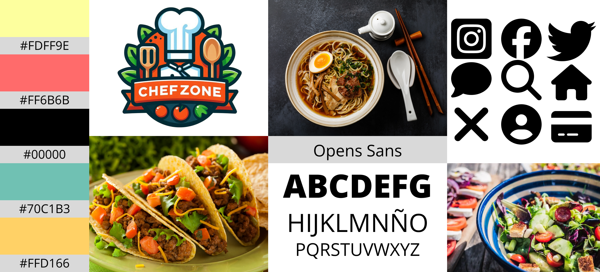
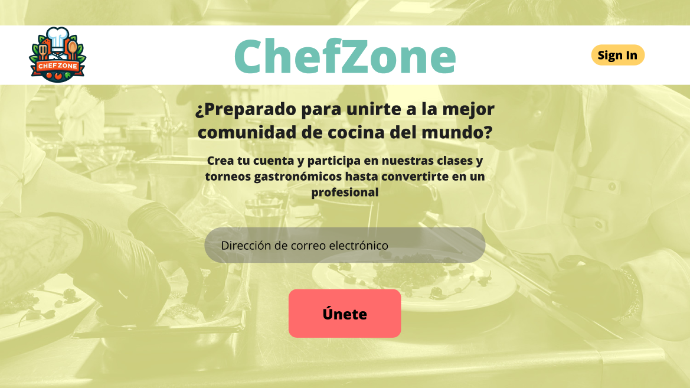
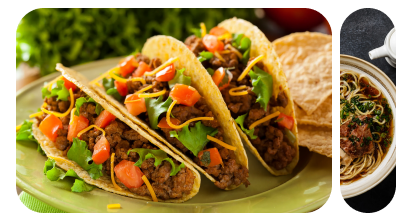
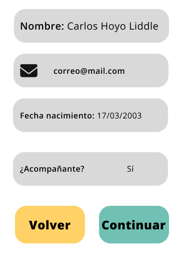
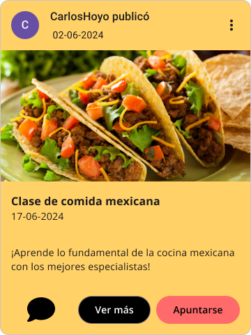
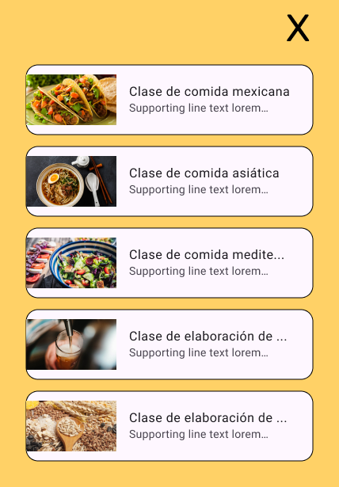
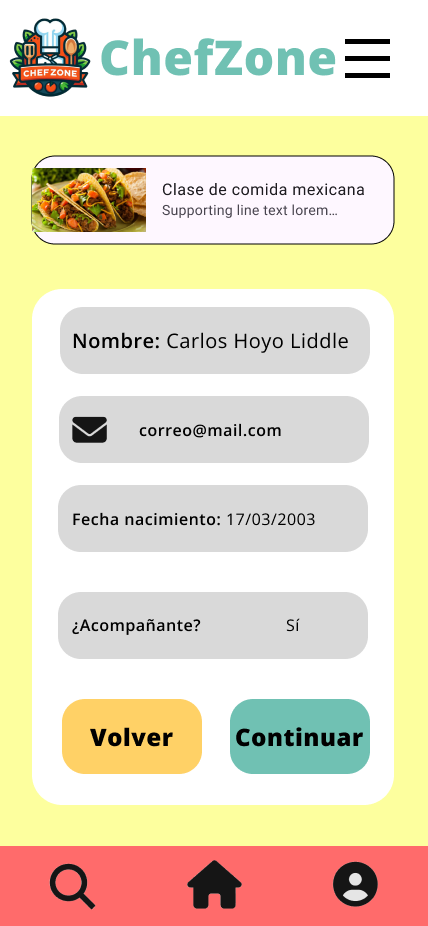
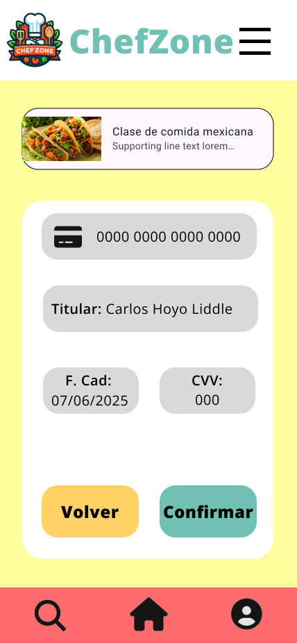

# DIU - Practica 3, entregables

## Moodboard (diseño visual + logotipo) 

- ### Logo
  El logo elegido contiene el nombre de la aplicación, ChefZone, además de los elementos relacionados con lo que los usuarios de esta aplicación buscarán, que es todo lo relacionado con la cocina y con el arte de aprenderla.

- ## Paleta de colores
  -	Pale canary: representa armonía, algo fundamental en la cocina, que nos ayudará a manejar las situaciones más estresantes.
  -	Bittersweet: representa la emoción e intensidad que pueden tener los concursos de cocina.
  -	Black: añade un toque de elegancia y poder a la paleta.
  -	Tradewind: este color aporta frescura y naturalidad.
  -	Golden tainoi: complementa al color principal dando un toque más de fuerza e intensidad, algo necesario para cualquier cocinero.
- ## Fuente
  Opens Sans: es una fuente Sans-Serif, con un aspecto muy limpio y moderno, lo que la hace una fuente perfecta para una gran cantidad de diseños.

## Landing Page

## Mockup: LAYOUT HI-FI
- ### Guidelines
  - Barra de búsqueda
    - 
  - Carousel
    - 
  - Form
    - 
  - Item card
    - 
  - Item list
    - 
  - Nav Bar
    - 
  - Wizards
    - 
    - 
  - About Us
    - 

## Documentación: Publicación del Case Study

(incluye) Valoración del equipo sobre la realización de esta práctica o los problemas surgidos
 
