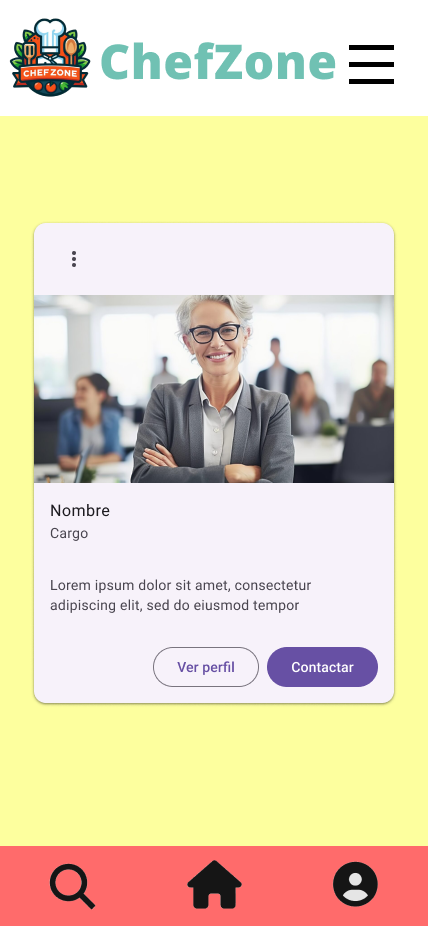

# DIU - Practica 3, entregables

## Moodboard (diseño visual + logotipo) 

- ### Logo
  El logo elegido contiene el nombre de la aplicación, ChefZone, además de los elementos relacionados con lo que los usuarios de esta aplicación buscarán, que es todo lo relacionado con la cocina y con el arte de aprenderla.

- ## Paleta de colores
  -	Pale canary(#FDFF9E): representa armonía, algo fundamental en la cocina, que nos ayudará a manejar las situaciones más estresantes.
  -	Bittersweet(#FF6B6B): representa la emoción e intensidad que pueden tener los concursos de cocina.
  -	Black(#000000): añade un toque de elegancia y poder a la paleta.
  -	Tradewind(#70C1B3): este color aporta frescura y naturalidad.
  -	Golden tainoi(#FFD166): complementa al color principal dando un toque más de fuerza e intensidad, algo necesario para cualquier cocinero.
- ## Fuente
  Opens Sans: es una fuente Sans-Serif, con un aspecto muy limpio y moderno, lo que la hace una fuente perfecta para una gran cantidad de diseños.

## Landing Page

## Mockup: LAYOUT HI-FI
- ### Guidelines
  - Barra de búsqueda
    - 
  - Carousel
    - 
  - Form
    - 
  - Item card
    - 
  - Item list
    - 
  - Nav Bar
    - 
  - Wizards
    
    Para los wizards no hay un elemento en sí que muestre el proceso que llevamos, ya que hay únicamente dos pasos a seguir, introducir nuestros datos e introducir un método de pago.
    -     
  - About Us
    - 

      
- ### Layout Hi-Fi
  El layout se ha implementado en <a href="https://www.figma.com/design/c8AbgRcvawjuxy6fYGhcvU/LayoutP3?node-id=0-1&t=lPhWeKOIqr4AkmLu-0">Figma</a>. Aquí se pueden ejecutar las transiciones del diseño y ver cómo funciona.

  Consta de una página inicial con el logo de la aplicación y un pequeño eslogan, la cual se difuminará pasado un segundo, dando lugar a la página principal. Una vez aquí, podremos acceder a las clases pulsando la foto que aparece y realizar el proceso de apuntarse.  
  
  El diseño también contiene un menú desplegable mediante el cual podremos acceder a las clases o al apartado About Us, en el cual se encuentran lo que serían los perfiles de los miembros del equipo.

## Valoración

Esta práctica es muy interesante, ya que en ella se aprende a usar Figma en cierta profundidad, dando la posibilidad de tener un boceto bastante realista de la aplicación que se quiere llegar a implementar.
 
