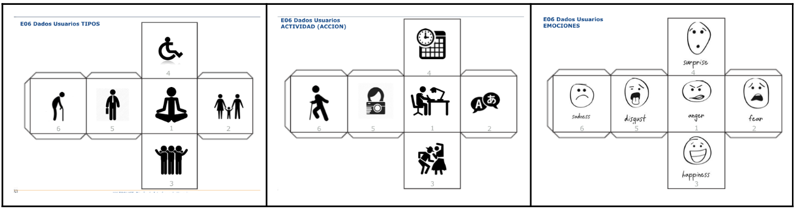
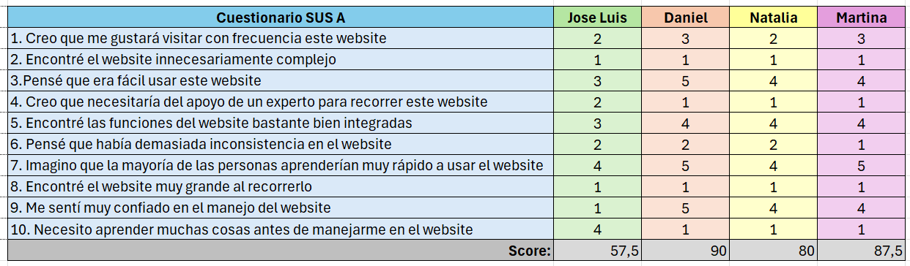
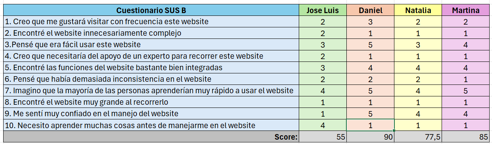
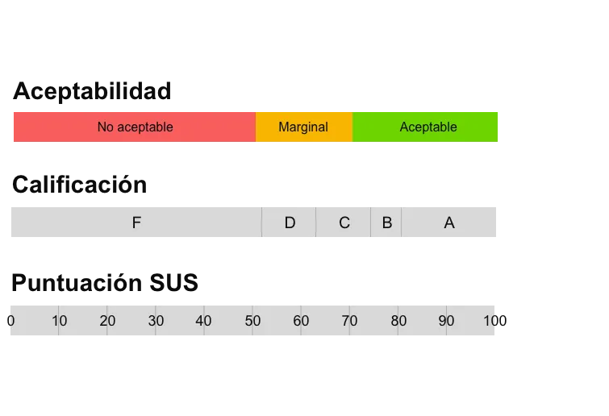

# DIU - Practica 4, entregables

Proyecto a analizar: https://github.com/Gonzalo845/DIUElPatio  

* Users
  
  Se han creado 4 usuarios en base a los dados mostrados en el guion de la práctica.
  
  

  - Persona 1 (6, 4, 2): Jose Luis es una persona jubilada de 70 años que, tras una vida trabajando duramente, se ha decidido en aprovechar al máximo su tiempo ahora que tiene la posibilidad de hacerlo. No obstante, tiene un poco de miedo a cómo comenzar a hacer esto debido a su poco manejo con las tecnologías. Por esto, Jose Luis necesita una plataforma fácil e intuituva de usar, donde las cosas principales estén los más visible que se pueda.
  - Persona 2 (2, 1, 3): Daniel es un padre de familia de 35 años. Su familia está formada únicamente por él; su mujer, Rosa, de su misa edad; y su hija, María, de 7 años. Se dedica al desarrollo de software y es una persona bastante feliz con su vida en general. Tiene obviamente mucho conocimiento acerca de tecnologías y no le cuesta adaptarse a nuevas.
  - Persona 3(4, 2, 6): Natalia es una persona discapacitada de 25 años que va en silla de ruedas, con mucho conocimiento de idiomas y que está un poco triste con su vida. Conoce la tecnología como cualquier persona que haya crecido con ella la puede conocer, es decir, sabe usarla aunque no la conoce en profuncidad. Natalia necesita actividades que puedan realizar todo tipo de personas debido a su condición física.
  - Persona 4 (5, 1, 4): Martina es una empresaria de 42 años, la cual se pasa la mayor parte de su tiempo trabajando, aunque siempre le gusta poder irse de vacaciones con sus amigas de vez en cuando. Es una persona acostumbrada a trabajar con tecnología y, por su poco tiempo libre, necesita una plataforma que indique claramente la fecha y duración de las actividades ofrecidas.

Elección y características

| Id Usuario | Sexo | Edad | Ocupación | Experiencia en internet | Plataforma | Perfil cubierto | Test | SUS Score |
|------------|------|------|-----------|-------------------------|------------|-----------------|------|-----------|
| Jose Luis  | Masculino | 70 | Jubilado  | Baja                    | Windows    | Jubilado con ganas de disfrutar el tiempo que ahora tiene, pero asustado por la poca idea de usar tecnologías que posee| A/B | 23 |
| Daniel | Masculino | 35 | Desarrollo de software | Alta | MacOS | Padre de familia , feliz y con mucho conocimiento y experiencia en la tecnología | A/B | 23 |
| Natalia | Femenino | 25 | Traductora | Intermedia | Windows | Persona discapacitada que va en silla de ruedas, triste porque hay muchas actividades que no puede realizar por su condición física | A/B | 23 |
| Martina | Femenino | 42 | Empresaria | Intermedia/Alta | MacOS | Empresaria de 42 años, dedicada al trabajo pero con ganas de disfrutar el poco tiempo libre del que dispone | A/B | 23 |

* A/B Testing.

  Para el proyecto A:

  

  Para el proyecto B:

  

  Basándonos en la interpretación de las puntuaciones que sigue:
  

  El proyecto A ha recibido una valoración de 57.5 (Marginal D) por parte de Jose Luis, un 90 (Aceptable A) por parte de Daniel, un 80 (Aceptable A) por parte de Natalia y un 87.5 (Aceptable A) por parte de Martina. Se ve una variación considerable en la puntuación entre aquellos usuarios cuyos conocimientos del uso de internet y de las nuevas tecnologías es mayor respecto a aquellos donde es menor. La nota media sería, por tanto, 78.75 (Aceptable B/A).

  Por otro lado, el proyecto B ha recibido una puntuación de 55 (Marginal D) por parte de Jose Luis, un 90 (Aceptable A) por parte de Daniel, un 77,5 (Aceptable B) por parte de Natalia y un 85 (Aceptable A) por parte de Martina. Una vez más se ve la diferencia entre los usuarios con más conocimiento respecto a aquellos que tienen menos. La puntuación media para el proyecto B es, por tanto, de 76.88 (Aceptable B/A).

* Tareas realizadas

  Se ha realizado un Eye Track para cada proyecto mediante la plataforma GazeReporter.
  
  - Para el caso A:  

  https://github.com/carloshoyo/DIU/assets/130358033/6bcd3076-bf91-4105-a4dd-ef0bdb9b8419

  Para comprobar las áreas de interés pulse <a href="https://github.com/carloshoyo/DIU/tree/master/P4/AoI">aquí</a>

  - Para el caso B:

  https://github.com/carloshoyo/DIU/assets/130358033/5036a78d-b106-4efb-b012-9dccada0cc8f

* Usability Report de Caso B

  El usability report se ha hecho siguiendo la plantilla proporcionado en documento de Word y se puede encontrar <a href="https://github.com/carloshoyo/DIU/blob/master/P4/P4_UsabReport_DIU1_ElPatio_doneby_DIU2_CHL.pdf">aquí</a>.
* Template de usability.gob (https://www.usability.gov/how-to-and-tools/resources/templates/report-template-usability-test.html) 

* Conclusiones

Esta práctica es muy útil para testar nuestro proyecto y poder comparar nuestros resultados con los del proyecto B, de manera que veamos en qué hemos podido ser mejores y en qué necesitamos mejorar de cara a mejorar nuestro producto.
