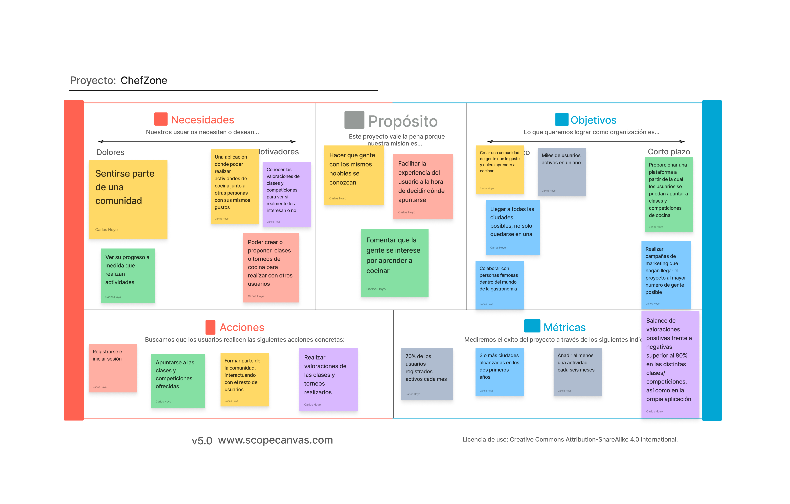

# DIU24
Prácticas Diseño Interfaces de Usuario 2023-24 (Tema: .... ) 

Grupo: DIU1_01AABB.  Curso: 2023/24 
Updated: 11/2/2024

Proyecto: 
>>> ChefZone

Descripción: 

>>> _ChefZone_ es una aplicación web para aquellos amantes de la gastronomía a los que no solo les gusta probar la comida, si no que su verdadera pasión es crearla. Se basa en un sistema en el que los clientes se puedan registrar, teniendo así su perfil para poder apuntarse a clases torneos de cocina y dar su opinión acerca de estos. Esto también servirá para poder ver las clases y torneos en los que un usuario está apuntado y los que ha realizado anteriormente, además de poder ver qué otros usuarios hay apuntados a estos. Cada cliente tendrá un rango asociado, cuantos más clases complete exitosamente, mayor rango alcanzará. De la misma forma, cuantos más torneos gane, mayor será su rango. Al llegar a un cierto rango, los usuarios podrán crear o proponer sus propias actividades, las cuales podrán hacer de forma individual o colaborando con otros usuarios.

Logotipo: 

Miembros
 * :bust_in_silhouette:   Carlos Hoyo Liddle     :octocat:

----- 

# Proceso de Diseño 

## Paso 1. UX User & Desk Research & Analisis 

<h2><a href="https://github.com/carloshoyo/DIU/blob/master/P1/P1-2b%20User%20Research%20Plan%20Template.pdf">1a. User research (plan) template </a></h2>
 
  Se ha realizado el User Resarch para la página Granada Cooking, con el objetivo de encontarr el tipo de clientes que atrerá la página y cuáles pueden ser algunos de sus requisitos más importantes.
  

<h2><a href="https://github.com/carloshoyo/DIU/blob/master/P1/Competitor%20Analysis%20%5BDIU23%5D.pdf">1b. Desk research: Análisis Competencia</a></h2>
-----
Se han elegido tres competidores diferentes:
  - PilsaEduca (https://pilsaeduca.com/)
  - GastroTrips (https://gastrotrips.es/events-and-teambuilding/)
  - FicZone (https://www.ficzone.com/talleres-gastronomicos/)

  Se ha analizado a cada uno de ellos en base a una serie de campos. En primer lugar, tenemos el modelo de negocio, en el     que se han evaluado los precios, las actividad o productos ofertados y la manera de vender estos productos. En este apartado, el mayor valorado ha sido el tercero de los competidores, muy seguido por el primero, el cual ha bajado debido al coste de sus productos, mientras que el segundo no muestra ningún precio en la web sin que les contactes, lo cual también baja su valoración en marketing.
  
  Los tres siguientes bloques van un poco ligados, ya que todos se basan en aspectos de la página web, donde el mejor valorado es el primero de los competidores, ya que tiene un diseño muy bueno, acompañado de un buen funcionamiento en todos los dispositivos y una gran claridad a la hora de mostrar la amplia gama de ofertas, mientras que los otros dos competidores no son tan fuertes en estos aspectos.
  
  Finalmente, como conclusión saco que tanto PilsaEduca como FicZone son buenos competidores debido al gran número de cosas buenas a destacar en comparación con las no tan buenas, mientras que GastroTrips está un escalón por debajo de estos.

 1.c Persona
-----
Se han creado dos personas. En primer lugar tenemos a <a href="https://github.com/carloshoyo/DIU/blob/master/P1/Persona%20%26%20User%20Journey%20Map1.pdf">Ellijah</a> , un hombre bastante feliz en general, de 38 años, economista, casado y con dos hijas, cuyas principales preocupaciones son su familia, su carrera profesional y el deporte. Le encanta viajar y realizar actividades con su familia, por lo que los talleres ofrecidos por Granada Cooking son perfectos para su viaje a Andalucía.
  
  Por otro lado está <a href="https://github.com/carloshoyo/DIU/blob/master/P1/Persona%20%26%20User%20Journey%20Map2.pdf">Gina</a>, de 31 años, enfermera, la cual está pasando un momento complicado tras varias malas experiencias con pacientes, por lo que se encuentra en busca de un cambio de aires y de nuevas experiencias en las que conocer gente. Al encontrarse con un viaje en grupo organizado a Granada, decide apuntarse y ver qué le puede deparar la experiencia.  

 1.d User Journey Map
----
En primer lugar, tenemos el Journey Map de Ellijah, el cual, mientras busca actividades para realizar con su familia durante el viaje, se topa con la página de Granada Cooking y comienza a indagar un poco más acerca de sus ofertas. Tras echar un largo vistazo a todas las ofertas, encuentra la que mejor se adapta a él y su familia y decide realizar una reserva.

  En segundo lugar está Gina, que se ha encontrado en redes sociales con un viaje organizado para gente que no se conoce entre sí, con el objetivo de hacer nuevos amigos al mismo tiempo que se llevan a cabo actividades divertidas. Una de ellas es un taller de cocina en Granada de la mano de Granada Cooking y, tras mirar un poco y consultar a gente que ya ha participado, decide apuntarse.

 <h2><a href="https://github.com/carloshoyo/DIU/blob/master/P1/Usability-review-template.xlsx">1 e. Revisión de Usabilidad</a></h2>
----
En la revisión de usabilidad de Granada Cooking sale un resultado de 77 (Good), ya que, por lo general, la página funciona bien, aunque tiene ciertos aspectos a mejorar.

En resumen, creo que la realización de los pasos de esta práctica es bastante importante de cara a centrar un poco un negocio en el tipo de cliente que puede o quiere esperar, además de ayudar a identificar y solventar aquellos problemas que pueda tener nuestro sistema, para así ser capaces de ofrecer la mayor calidad y garantía posible a nuestros clientes.

  

## Paso 2. UX Design  

 2.a Reframing / IDEACION: Feedback Capture Grid / EMpathy map 
----

### Ideación. Malla receptora
  Se ha realizado una malla receptora de la página web Granada Cooking (https://granadacooking.com/), a partir de la cual se ha decidido crear una aplicación basada en actividades gastronómicas, que podrán ser clases de cocina o torneos, que cuente con un mayor número de posibilidades, pudiendo crear su usario y tener una experiencia más personalizada. También contará con un apartado de búsqueda más útil.
  

 2.b ScopeCanvas
----
* ### Propuesta de valor
_ChefZone_ es una aplicación web para aquellos amantes de la gastronomía a los que no solo les gusta probar la comida, si no que su verdadera pasión es crearla. Se basa en un sistema en el que los clientes se puedan registrar, teniendo así su perfil para poder apuntarse a clases torneos de cocina y dar su opinión acerca de estos. Esto también servirá para poder ver las clases y torneos en los que un usuario está apuntado y los que ha realizado anteriormente, además de poder ver qué otros usuarios hay apuntados a estos. Cada cliente tendrá un rango asociado, cuantos más clases complete exitosamente, mayor rango alcanzará. De la misma forma, cuantos más torneos gane, mayor será su rango. Al llegar a un cierto rango, los usuarios podrán crear o proponer sus propias actividades, las cuales podrán hacer de forma individual o colaborando con otros usuarios.

* ### Scope Canvas
  

 2.b User Flow (task) analysis 
-----
* ### User Task Matrix
  Se ha hecho una matriz de tareas en la que se tienen en cuenta cuatro grupos de usuarios. En primer lugar, aquellos usuarios que no están registrados, es decir, los invitados, para los cuales no estarán disponibles algunas tareas que requieran tener un perfil de usuario creado. Después tenemos a los usarios registrados, que se dividen en tres, los que se acaban de registrar, los que no tienen niguna plaza reservada en niguna actividad pero ya han realizado alguna anteriormente y los que están apuntados a alguna actividad. Una actividad puede ser tanto una clase como un torneo. En las clases se aprenderán cosas concretas de cocina, mientras que en los torneos se propondrán platos, los cuales deberán ser realizados por los participantes.
  
  
* ### User/Task flow
  
  Se han realizado tres user flow, el <a href="https://github.com/carloshoyo/DIU/blob/master/P2/UserFlow1.pdf">primero</a> representando la acción de apuntarse a una actividad, el <a href="https://github.com/carloshoyo/DIU/blob/master/P2/UserFlow2.pdf">segundo</a> la acción de gestionar reservas, con la opción de modificar o eliminar una reserva y el <a href="https://github.com/carloshoyo/DIU/blob/master/P2/UserFlow3.pdf">tercero</a> la acción de editar el perfil, con las opciones de cambiar foto, nombre, contraseña, correo o biografía del usuario.

 2.c IA: Sitemap + Labelling 
----
* ### Sitemap
  
* ### Labelling
  
  

 2.d Wireframes
-----
Se ha realizado el boceto de la página principal, en la cual encontramos una barra de navegación con un logo (por definir), enlaces a las clases y torneos disponibles, una barra de búsqueda y un apartado para registrarse o iniciar sesión.

Después tenemos el cuerpo, en el cual encontramos por un lado las clases más solicitadas, con una foto, que irá cambiando cada ciertos segundos para mostrar diferentes clases y lo mismo en el otro lado para los torneos. 

Por último, encontramos el pie de página, con un apartado de ayuda y otro para la información acerca de los creadores. La estructura es la siguiente:

Se ha utilizado el plugin Breakpoint para realizar un diseño responsive que funcione tanto en ordeandor como en dispositivos móviles y tablets. Se encuentra <a href="https://www.figma.com/file/NC8mN6Aw2ZVW5NZlr3TDBj/BocetosP2?type=design&mode=design&t=83ghPbgD99bRGhE0-0">aquí</a>.

## Paso 3. Mi UX-Case Study (diseño)

 3.a Moodboard
-----

>>> Plantear Diseño visual con una guía de estilos visual (moodboard) 
>>> Incluir Logotipo
>>> Si diseña un logotipo, explique la herramienta utilizada y la resolución empleada. ¿Puede usar esta imagen como cabecera de Twitter, por ejemplo, o necesita otra?

  3.b Landing Page
----

>>> Plantear Landing Page 

 3.c Guidelines
----

>>> Estudio de Guidelines y Patrones IU a usar 
>>> Tras documentarse, muestre las deciones tomadas sobre Patrones IU a usar para la fase siguiente de prototipado. 

  3.d Mockup
----

>>> Layout: Mockup / prototipo HTML  (que permita simular tareas con estilo de IU seleccionado)

 3.e ¿My UX-Case Study?
-----

>>> Publicar my Case Study en Github..
>>> Documente y resuma el diseño de su producto

## Paso 5. Exportación & evaluación con Eye Tracking 

Exportación a HTML/Flutter
-----

)  5.b Eye Tracking method 

>>> Indica cómo diseñas experimento y reclutas usuarios (uso de gazerecorder.com)  

Diseño del experimento 
----

>> Uso de imágenes (preferentemente) -> hay que esablecer una duración de visualización y  
>> fijar las áreas de interes (AoI) antes del diseño. Planificar qué tarea debe hacer el usuario (buscar, comprar...) 

  
>> cambiar img por tu diseño de experimento  

>> Recordar que gazerecorder es una versión de pruebas: usar sólo con 3 usuarios para generar mapa de calor (recordar que crédito > 0 para que funcione) 

Resultados y valoración 
-----

>> Cambiar por tus resultados
  

## Paso 4. Evaluación 

 4.a Caso asignado
----

>>> Breve descripción del caso asignado con enlace a  su repositorio Github

 4.b User Testing
----

>>> Seleccione 4 personas ficticias. Exprese las ideas de posibles situaciones conflictivas de esa persona en las propuestas evaluadas. Asigne dos a Caso A y 2 al caso B
 

| Usuarios | Sexo/Edad     | Ocupación   |  Exp.TIC    | Personalidad | Plataforma | TestA/B
| ------------- | -------- | ----------- | ----------- | -----------  | ---------- | ----
| User1's name  | H / 18   | Estudiante  | Media       | Introvertido | Web.       | A 
| User2's name  | H / 18   | Estudiante  | Media       | Timido       | Web        | A 
| User3's name  | M / 35   | Abogado     | Baja        | Emocional    | móvil      | B 
| User4's name  | H / 18   | Estudiante  | Media       | Racional     | Web        | B 

 4.c Cuestionario SUS
----

>>> Usaremos el **Cuestionario SUS** para valorar la satisfacción de cada usuario con el diseño (A/B) realizado. Para ello usamos la [hoja de cálculo](https://github.com/mgea/DIU19/blob/master/Cuestionario%20SUS%20DIU.xlsx) para calcular resultados sigiendo las pautas para usar la escala SUS e interpretar los resultados
http://usabilitygeek.com/how-to-use-the-system-usability-scale-sus-to-evaluate-the-usability-of-your-website/)
Para más información, consultar aquí sobre la [metodología SUS](https://cui.unige.ch/isi/icle-wiki/_media/ipm:test-suschapt.pdf)

>>> Adjuntar captura de imagen con los resultados + Valoración personal 

 4.d Usability Report
----

>> Añadir report de usabilidad para práctica B (la de los compañeros)

>>> Valoración personal 

5.) Conclusion de EVALUACION (A/B testing + usability report + eye tracking) 
----

>> recupera el usability report de tu práctica (que es el caso B de los asignados a otros grupos) 
>> con los resultados del A/B testing, de eye tracking y del usability report:
>>  comentad en 2-3 parrafos cual es la conclusion acerca de la realización de la práctica y su evaluación con esas técnicas y que habéis aprendido

## Conclusión final / Valoración de las prácticas

>>> (90-150 palabras) Opinión FINAL del proceso de desarrollo de diseño siguiendo metodología UX y valoración (positiva /negativa) de los resultados obtenidos  

