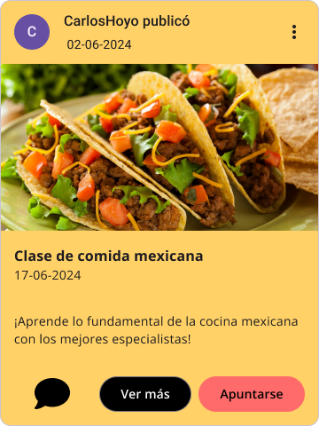
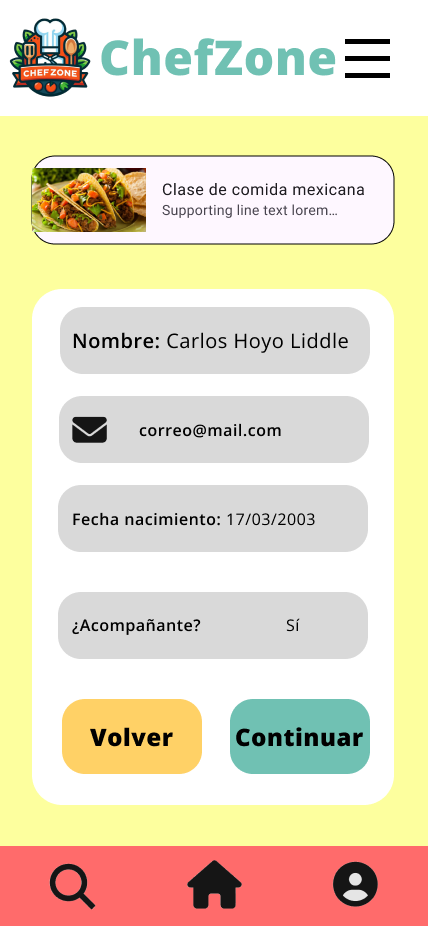
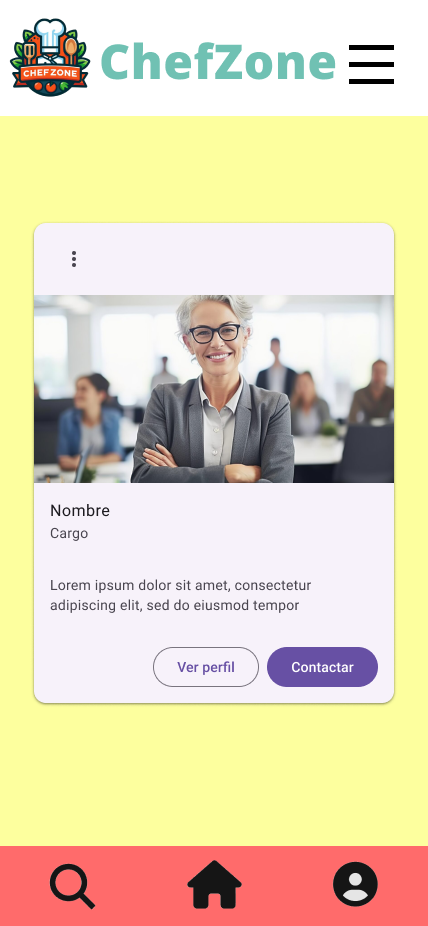

# DIU24
Prácticas Diseño Interfaces de Usuario 2023-24 (Tema: .... ) 

Grupo: DIU2_CHL.  Curso: 2023/24 
Updated: 11/2/2024

Proyecto: 
>>> ChefZone

Descripción: 

>>> _ChefZone_ es una aplicación web para aquellos amantes de la gastronomía a los que no solo les gusta probar la comida, si no que su verdadera pasión es crearla. Se basa en un sistema en el que los clientes se puedan registrar, teniendo así su perfil para poder apuntarse a clases torneos de cocina y dar su opinión acerca de estos. Esto también servirá para poder ver las clases y torneos en los que un usuario está apuntado y los que ha realizado anteriormente, además de poder ver qué otros usuarios hay apuntados a estos. Cada cliente tendrá un rango asociado, cuantos más clases complete exitosamente, mayor rango alcanzará. De la misma forma, cuantos más torneos gane, mayor será su rango. Al llegar a un cierto rango, los usuarios podrán crear o proponer sus propias actividades, las cuales podrán hacer de forma individual o colaborando con otros usuarios.

Logotipo: 

Miembros
 * :bust_in_silhouette:   Carlos Hoyo Liddle     :octocat:

----- 

# Proceso de Diseño 

## Paso 1. UX User & Desk Research & Analisis 

<h2><a href="https://github.com/carloshoyo/DIU/blob/master/P1/P1-2b%20User%20Research%20Plan%20Template.pdf">1a. User research (plan) template </a></h2>
 
  Se ha realizado el User Resarch para la página Granada Cooking, con el objetivo de encontarr el tipo de clientes que atrerá la página y cuáles pueden ser algunos de sus requisitos más importantes.
  

<h2><a href="https://github.com/carloshoyo/DIU/blob/master/P1/Competitor%20Analysis%20%5BDIU23%5D.pdf">1b. Desk research: Análisis Competencia</a></h2>
-----
Se han elegido tres competidores diferentes:
  - PilsaEduca (https://pilsaeduca.com/)
  - GastroTrips (https://gastrotrips.es/events-and-teambuilding/)
  - FicZone (https://www.ficzone.com/talleres-gastronomicos/)

  Se ha analizado a cada uno de ellos en base a una serie de campos. En primer lugar, tenemos el modelo de negocio, en el     que se han evaluado los precios, las actividad o productos ofertados y la manera de vender estos productos. En este apartado, el mayor valorado ha sido el tercero de los competidores, muy seguido por el primero, el cual ha bajado debido al coste de sus productos, mientras que el segundo no muestra ningún precio en la web sin que les contactes, lo cual también baja su valoración en marketing.
  
  Los tres siguientes bloques van un poco ligados, ya que todos se basan en aspectos de la página web, donde el mejor valorado es el primero de los competidores, ya que tiene un diseño muy bueno, acompañado de un buen funcionamiento en todos los dispositivos y una gran claridad a la hora de mostrar la amplia gama de ofertas, mientras que los otros dos competidores no son tan fuertes en estos aspectos.
  
  Finalmente, como conclusión saco que tanto PilsaEduca como FicZone son buenos competidores debido al gran número de cosas buenas a destacar en comparación con las no tan buenas, mientras que GastroTrips está un escalón por debajo de estos.

 1.c Persona
-----
Se han creado dos personas. En primer lugar tenemos a <a href="https://github.com/carloshoyo/DIU/blob/master/P1/Persona%20%26%20User%20Journey%20Map1.pdf">Ellijah</a> , un hombre bastante feliz en general, de 38 años, economista, casado y con dos hijas, cuyas principales preocupaciones son su familia, su carrera profesional y el deporte. Le encanta viajar y realizar actividades con su familia, por lo que los talleres ofrecidos por Granada Cooking son perfectos para su viaje a Andalucía.
  
  Por otro lado está <a href="https://github.com/carloshoyo/DIU/blob/master/P1/Persona%20%26%20User%20Journey%20Map2.pdf">Gina</a>, de 31 años, enfermera, la cual está pasando un momento complicado tras varias malas experiencias con pacientes, por lo que se encuentra en busca de un cambio de aires y de nuevas experiencias en las que conocer gente. Al encontrarse con un viaje en grupo organizado a Granada, decide apuntarse y ver qué le puede deparar la experiencia.  

 1.d User Journey Map
----
En primer lugar, tenemos el Journey Map de Ellijah, el cual, mientras busca actividades para realizar con su familia durante el viaje, se topa con la página de Granada Cooking y comienza a indagar un poco más acerca de sus ofertas. Tras echar un largo vistazo a todas las ofertas, encuentra la que mejor se adapta a él y su familia y decide realizar una reserva.

  En segundo lugar está Gina, que se ha encontrado en redes sociales con un viaje organizado para gente que no se conoce entre sí, con el objetivo de hacer nuevos amigos al mismo tiempo que se llevan a cabo actividades divertidas. Una de ellas es un taller de cocina en Granada de la mano de Granada Cooking y, tras mirar un poco y consultar a gente que ya ha participado, decide apuntarse.

 <h2><a href="https://github.com/carloshoyo/DIU/blob/master/P1/Usability-review-template.xlsx">1 e. Revisión de Usabilidad</a></h2>
----
En la revisión de usabilidad de Granada Cooking sale un resultado de 77 (Good), ya que, por lo general, la página funciona bien, aunque tiene ciertos aspectos a mejorar.

En resumen, creo que la realización de los pasos de esta práctica es bastante importante de cara a centrar un poco un negocio en el tipo de cliente que puede o quiere esperar, además de ayudar a identificar y solventar aquellos problemas que pueda tener nuestro sistema, para así ser capaces de ofrecer la mayor calidad y garantía posible a nuestros clientes.

  

## Paso 2. UX Design  

 2.a Reframing / IDEACION: Feedback Capture Grid / EMpathy map 
----

### Ideación. Malla receptora
  Se ha realizado una malla receptora de la página web Granada Cooking (https://granadacooking.com/), a partir de la cual se ha decidido crear una aplicación basada en actividades gastronómicas, que podrán ser clases de cocina o torneos, que cuente con un mayor número de posibilidades, pudiendo crear su usario y tener una experiencia más personalizada. También contará con un apartado de búsqueda más útil.
  

 2.b ScopeCanvas
----
* ### Propuesta de valor
_ChefZone_ es una aplicación web para aquellos amantes de la gastronomía a los que no solo les gusta probar la comida, si no que su verdadera pasión es crearla. Se basa en un sistema en el que los clientes se puedan registrar, teniendo así su perfil para poder apuntarse a clases torneos de cocina y dar su opinión acerca de estos. Esto también servirá para poder ver las clases y torneos en los que un usuario está apuntado y los que ha realizado anteriormente, además de poder ver qué otros usuarios hay apuntados a estos. Cada cliente tendrá un rango asociado, cuantos más clases complete exitosamente, mayor rango alcanzará. De la misma forma, cuantos más torneos gane, mayor será su rango. Al llegar a un cierto rango, los usuarios podrán crear o proponer sus propias actividades, las cuales podrán hacer de forma individual o colaborando con otros usuarios.

* ### Scope Canvas
  

 2.b User Flow (task) analysis 
-----
* ### User Task Matrix
  Se ha hecho una matriz de tareas en la que se tienen en cuenta cuatro grupos de usuarios. En primer lugar, aquellos usuarios que no están registrados, es decir, los invitados, para los cuales no estarán disponibles algunas tareas que requieran tener un perfil de usuario creado. Después tenemos a los usarios registrados, que se dividen en tres, los que se acaban de registrar, los que no tienen niguna plaza reservada en niguna actividad pero ya han realizado alguna anteriormente y los que están apuntados a alguna actividad. Una actividad puede ser tanto una clase como un torneo. En las clases se aprenderán cosas concretas de cocina, mientras que en los torneos se propondrán platos, los cuales deberán ser realizados por los participantes.
  
  
* ### User/Task flow
  
  Se han realizado tres user flow, el <a href="https://github.com/carloshoyo/DIU/blob/master/P2/UserFlow1.pdf">primero</a> representando la acción de apuntarse a una actividad, el <a href="https://github.com/carloshoyo/DIU/blob/master/P2/UserFlow2.pdf">segundo</a> la acción de gestionar reservas, con la opción de modificar o eliminar una reserva y el <a href="https://github.com/carloshoyo/DIU/blob/master/P2/UserFlow3.pdf">tercero</a> la acción de editar el perfil, con las opciones de cambiar foto, nombre, contraseña, correo o biografía del usuario.

 2.c IA: Sitemap + Labelling 
----
* ### Sitemap
  
* ### Labelling
  
  

 2.d Wireframes
-----
Se ha realizado el boceto de la página principal, en la cual encontramos una barra de navegación con un logo (por definir), enlaces a las clases y torneos disponibles, una barra de búsqueda y un apartado para registrarse o iniciar sesión.

Después tenemos el cuerpo, en el cual encontramos por un lado las clases más solicitadas, con una foto, que irá cambiando cada ciertos segundos para mostrar diferentes clases y lo mismo en el otro lado para los torneos. 

Por último, encontramos el pie de página, con un apartado de ayuda y otro para la información acerca de los creadores. La estructura es la siguiente:

Se ha utilizado el plugin Breakpoint para realizar un diseño responsive que funcione tanto en ordeandor como en dispositivos móviles y tablets. Se encuentra <a href="https://www.figma.com/file/NC8mN6Aw2ZVW5NZlr3TDBj/BocetosP2?type=design&mode=design&t=83ghPbgD99bRGhE0-0">aquí</a>.

## Paso 3. Mi UX-Case Study (diseño)

 3.a Moodboard
-----

- ### Logo
  El logo elegido contiene el nombre de la aplicación, ChefZone, además de los elementos relacionados con lo que los usuarios de esta aplicación buscarán, que es todo lo relacionado con la cocina y con el arte de aprenderla. Para la creación del mismo se ha utilizado la herramienta Image Creator, de Microsoft.

- ### Paleta de colores
  -	Pale canary(#FDFF9E): representa armonía, algo fundamental en la cocina, que nos ayudará a manejar las situaciones más estresantes.
  -	Bittersweet(#FF6B6B): representa la emoción e intensidad que pueden tener los concursos de cocina.
  -	Black(#000000): añade un toque de elegancia y poder a la paleta.
  -	Tradewind(#70C1B3): este color aporta frescura y naturalidad.
  -	Golden tainoi(#FFD166): complementa al color principal dando un toque más de fuerza e intensidad, algo necesario para cualquier cocinero.
- ### Fuente
  Opens Sans: es una fuente Sans-Serif, con un aspecto muy limpio y moderno, lo que la hace una fuente perfecta para una gran cantidad de diseños.

  3.b Landing Page
----

 3.c Guidelines
----
- Barra de búsqueda
    - 
  - Carousel
    - 
  - Form
    - 
  - Item card
    - 
  - Item list
    - 
  - Nav Bar
    - 
  - Wizards
    
    Para los wizards no hay un elemento en sí que muestre el proceso que llevamos, ya que hay únicamente dos pasos a seguir, introducir nuestros datos e introducir un método de pago.
    -     
  - About Us
    - 
 

  3.d Mockup
----

El layout se ha implementado en <a href="https://www.figma.com/design/c8AbgRcvawjuxy6fYGhcvU/LayoutP3?node-id=0-1&t=lPhWeKOIqr4AkmLu-0">Figma</a>. Aquí se pueden ejecutar las transiciones del diseño y ver cómo funciona.

  Consta de una página inicial con el logo de la aplicación y un pequeño eslogan, la cual se difuminará pasado un segundo, dando lugar a la página principal. Una vez aquí, podremos acceder a las clases pulsando la foto que aparece y realizar el proceso de apuntarse.  
  
  El diseño también contiene un menú desplegable mediante el cual podremos acceder a las clases o al apartado About Us, en el cual se encuentran lo que serían los perfiles de los miembros del equipo.

  Vídeo demostración de cómo usar el mockup:

  https://github.com/carloshoyo/DIU/assets/130358033/ee9cc228-30a9-41eb-9601-f6ce86c6011c

 3.e ¿My UX-Case Study?

-----

>>> Publicar my Case Study en Github..
>>> Documente y resuma el diseño de su producto

## Paso 5. Exportación & evaluación con Eye Tracking 

Exportación a HTML/Flutter
-----

)  5.b Eye Tracking method 

>>> Para realizar el Eye Tracking se ha utilizado la plataforma GazeRecorder, mediante la cual podemos ver un mapa de calor con los puntos donde se ha concentrado la vista del usuario, haciendo posible ver si hemos llamado la atención en los puntos deseados o no.

Diseño del experimento 
----

>> Para llevar a cabo el experimento, primero han de definirse unas áreas de interés en cada página, es decir, aquellos puntos que consideramos que deberían ser los puntos donde el usuario concentre la mayor parte de su atención.
>> Estas áreas de interés definidas son las siguientes:
     

Resultados y valoración 
-----
El resultado generado en forma de vídeo es el siguiente:

https://github.com/carloshoyo/DIU/assets/130358033/b9041139-f472-44f1-ac2a-2fa17a32eacb

## Paso 4. Evaluación 

 4.a Caso asignado
----

 El caso asignado es el proyecto EnderLands, llevado a cabo por el grupo DIU3_09_ElPatio, cuyo repositorio de GitHub podemos encontrar <a href="https://github.com/Gonzalo845/DIUElPatio">aquí.</a>

 4.b User Testing
----

 Se han creado 4 usuarios en base a los dados mostrados en el guion de la práctica.
  
  

  - Persona 1 (6, 4, 2): Jose Luis es una persona jubilada de 70 años que, tras una vida trabajando duramente, se ha decidido en aprovechar al máximo su tiempo ahora que tiene la posibilidad de hacerlo. No obstante, tiene un poco de miedo a cómo comenzar a hacer esto debido a su poco manejo con las tecnologías. Por esto, Jose Luis necesita una plataforma fácil e intuituva de usar, donde las cosas principales estén los más visible que se pueda.
  - Persona 2 (2, 1, 3): Daniel es un padre de familia de 35 años. Su familia está formada únicamente por él; su mujer, Rosa, de su misa edad; y su hija, María, de 7 años. Se dedica al desarrollo de software y es una persona bastante feliz con su vida en general. Tiene obviamente mucho conocimiento acerca de tecnologías y no le cuesta adaptarse a nuevas.
  - Persona 3(4, 2, 6): Natalia es una persona discapacitada de 25 años que va en silla de ruedas, con mucho conocimiento de idiomas y que está un poco triste con su vida. Conoce la tecnología como cualquier persona que haya crecido con ella la puede conocer, es decir, sabe usarla aunque no la conoce en profuncidad. Natalia necesita actividades que puedan realizar todo tipo de personas debido a su condición física.
  - Persona 4 (5, 1, 4): Martina es una empresaria de 42 años, la cual se pasa la mayor parte de su tiempo trabajando, aunque siempre le gusta poder irse de vacaciones con sus amigas de vez en cuando. Es una persona acostumbrada a trabajar con tecnología y, por su poco tiempo libre, necesita una plataforma que indique claramente la fecha y duración de las actividades ofrecidas.

 

| Id Usuario | Sexo | Edad | Ocupación | Experiencia en internet | Plataforma | Perfil cubierto | Test | SUS Score |
|------------|------|------|-----------|-------------------------|------------|-----------------|------|-----------|
| Jose Luis  | Masculino | 70 | Jubilado  | Baja                    | Windows    | Jubilado con ganas de disfrutar el tiempo que ahora tiene, pero asustado por la poca idea de usar tecnologías que posee| A/B | 57.5 |
| Daniel | Masculino | 35 | Desarrollo de software | Alta | MacOS | Padre de familia , feliz y con mucho conocimiento y experiencia en la tecnología | A/B | 90 |
| Natalia | Femenino | 25 | Traductora | Intermedia | Windows | Persona discapacitada que va en silla de ruedas, triste porque hay muchas actividades que no puede realizar por su condición física | A/B | 80 |
| Martina | Femenino | 42 | Empresaria | Intermedia/Alta | MacOS | Empresaria de 42 años, dedicada al trabajo pero con ganas de disfrutar el poco tiempo libre del que dispone | A/B | 87.5 |

 4.c Cuestionario SUS
----

>>> Usaremos el **Cuestionario SUS** para valorar la satisfacción de cada usuario con el diseño (A/B) realizado. Para ello usamos la [hoja de cálculo](https://github.com/mgea/DIU19/blob/master/Cuestionario%20SUS%20DIU.xlsx) para calcular resultados sigiendo las pautas para usar la escala SUS e interpretar los resultados
http://usabilitygeek.com/how-to-use-the-system-usability-scale-sus-to-evaluate-the-usability-of-your-website/)
Para más información, consultar aquí sobre la [metodología SUS](https://cui.unige.ch/isi/icle-wiki/_media/ipm:test-suschapt.pdf)

Para el proyecto A:

Para el proyecyo B:

 4.d Usability Report
----

 Para el Usability Report se ha utilizado la plantilla Word proporcionada, la cual puede encontrarse <a href="https://github.com/carloshoyo/DIU/blob/master/P4/P4_UsabReport_DIU1_ElPatio_doneby_DIU2_CHL.pdf">aquí.</a>

5.) Conclusion de EVALUACION (A/B testing + usability report + eye tracking) 
----

Esta práctica es muy útil de cara a evaluar nuestro proyecto y su usabilidad, comparándolo además con otro proyecto para ver las cosas en las que tenemos que mejorar principalmente.
Las técnicas usadas son muy ingeniosas y sobre todo útiles de cara a observar qué aspectos de nuestro diseño son los que llaman más la atención de nuestros usuarios y cuáles pasan más desapercibidos.

## Conclusión final / Valoración de las prácticas
 En general, las prácticas realizadas para la asignatura han resultado útiles a la hora de conocer cómo se lleva a cabo el desarrollo de una aplicación en la vidad real, centrándose en el aspecto de la usabilidad y viéndolo desde el punto de vista del usuario en muchos casos, intentando empatizar con él para así poder identificar aquellos aspectos a mejorar y en los que prestar más atención.
 
 Además, considero que la introducción que se hace a Figma en esta asignatura es muy importante, ya que es una herramienta con un increíble potencial, en la que se puede realizar el diseño de una interfaz al completo, para después pasarla al producto final en sí mismo.

 También considero que la manera de evaluar la usabilidad de nuestra aplicación es interesante, ya que se aprenden cosas básicas para conseguir el "feedback" del cliente y así poder conocer las diferentes opiniones de la gente que hace uso de nuestro producto, ya que son estos quienes van a darle uso a fin de cuentas.

 En resumen, creo que las prácticas son bastante interesantes y útiles en nuestra formación como desarrolladores de software de cara a un futuro. 

